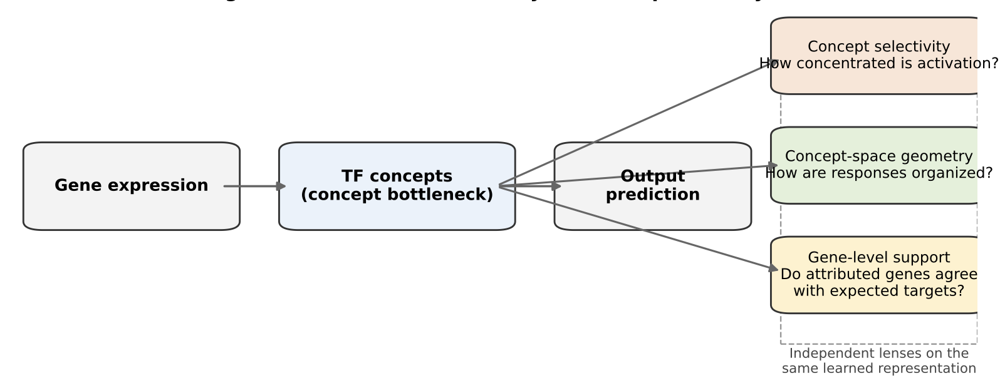

# Single-Cell Concept Interpretability

**A rigorous evaluation framework for interpretable machine learning in single-cell transcriptomics.**

## Overview

Interpretability has become a central objective in biological machine learning, yet there is no consensus on how it should be evaluated. Models are often considered interpretable because they recover biologically meaningful concepts or exhibit structured latent representations, but these properties alone do not necessarily establish mechanistic validity.

This repository accompanies the study *Layer- and regime-dependent interpretability in concept bottleneck models for single-cell transcriptomics* and introduces a multi-layer framework for evaluating interpretability across distinct biological regimes.

## Framework

Overview of the evaluation framework used to assess interpretability in concept bottleneck models across multiple biological regimes. The framework quantifies concept selectivity, concept-space geometry, and gene-level mechanistic support, demonstrating that structured representations do not necessarily imply mechanistic validity.

## Scientific Contributions

- Introduces a multi-dimensional framework for evaluating interpretability in concept bottleneck models.
- Separates concept selectivity, concept-space geometry, and gene-level mechanistic support as distinct dimensions of interpretability.
- Evaluates interpretability across multiple biological regimes and perturbation settings.
- Demonstrates that structured concept representations do not necessarily imply mechanistic validity.
- Provides fully documented computational workflows supporting reproducible research.

## Biological Systems Evaluated

- PBMC stimulation responses
- Interferon-driven transcriptional programs
- Norman Perturb-seq perturbations
- Replogle CRISPR perturbations

## Key Findings

- Interpretability is multi-dimensional rather than a single measurable property.
- Interpretability is strongly dependent on biological regime.
- Representation geometry alone is insufficient evidence of biological validity.
- Gene-level mechanistic support varies substantially across biological contexts.
- Multiple complementary criteria are required for rigorous interpretability assessment.

## Repository Resources

### Manuscript

- `paper.pdf`

### Publication Figures

- `Figure1_Framework.pdf`
- `Figure2_PBMC.pdf`
- `Figure3_Norman.pdf`
- `Figure4_Replogle.pdf`
- `Figure5_cross_dataset.pdf`

## Analysis Modules

This repository is organized around five complementary analysis modules that collectively evaluate interpretability across diverse biological settings.

| Notebook | Scientific Focus |
|-----------|----------|
| `01_pbmc_interpretability.ipynb` | Establishes baseline interpretability behavior in immune-cell stimulation experiments and evaluates concept selectivity, representation structure, and mechanistic support. |
| `02_norman_perturbseq.ipynb` | Investigates concept bottleneck representations in Perturb-seq data and evaluates interpretability under large-scale genetic perturbations. |
| `03_replogle_analysis.ipynb` | Examines mechanistic consistency and interpretability patterns across CRISPR-based perturbation screens. |
| `04_cross_dataset_comparison.ipynb` | Synthesizes results across datasets to identify regime-dependent and regime-independent interpretability behaviors. |
| `05_figure_generation.ipynb` | Reproduces the figures and summary visualizations presented in the manuscript. |

## Reproducibility

The notebooks provide detailed computational workflows documenting data processing, model evaluation, interpretability analyses, comparative assessments, and figure generation. Together they provide a transparent and reproducible record of the analytical procedures supporting the study.

## Citation

Yepes S. (2026).
*Layer- and regime-dependent interpretability in concept bottleneck models for single-cell transcriptomics.*

DOI: https://doi.org/10.5281/zenodo.19476507

